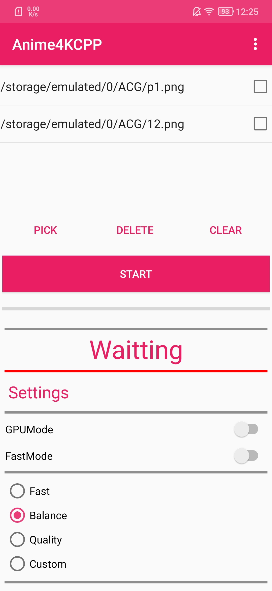

<div align="center">
  
</div>

<h1 align="center">
  Anime4KCPP
  </br>
  <a href="https://github.com/TianZerL/Anime4KCPP/releases"></a>
  
  
</h1>


### [**📄中文文档**](README.cn.md)
### [**📁Download**](https://github.com/TianZerL/Anime4KCPP/releases)
### [**📖Wiki**](https://github.com/TianZerL/Anime4KCPP/wiki)

# About Anime4KCPP
Anime4KCPP provides an optimized [bloc97's Anime4K](https://github.com/bloc97/Anime4K) algorithm version 0.9, and it also provides its own CNN algorithm ***ACNet***, it aims to be a high performance pretreatment tools to process both image and video.  
This project is for learning and the exploration task of algorithm course in SWJTU.  

***NOTICE: With CPU, it is fast enough to process normal image, It is about 12 times faster than [Go version](https://github.com/TianZerL/Anime4KGo), and 1300 times faster than [Python version](https://github.com/TianZerL/Anime4KPython). With GPU acceleration, it can be more than 10 times faster than CPU (depends on your graphic card), so it is suitable for video processing, just try this for higher quality and speed.***

# About Anime4K
Anime4K is a simple high-quality anime upscale algorithm. The version 0.9 does not use any machine learning approaches, and can be very fast in real-time processing or pretreatment.

# About ACNet
ACNet is a CNN based anime upscale algorithm. It aims to provide both high-quality and high-performance.

# Why Anime4KCPP
- Cross-platform, building have already tested in Windows ,Linux, and macOS (Thanks for [NightMachinary](https://github.com/NightMachinary)).
- Wide compatibility, support both CPU and GPU.
- easy to use with GUI or CLI.
- Android supports.
- VapourSynth plugin supports.
- AviSynthPlus plugin supports.
- High performance.
- Low memory usage, usually less than 1G even in processing 1080P videos.
- GPU acceleration support, use it to process your image or video in a short time.
- More arguments for you, you can get a better quality than real-time playback.
- Filters support, use them to denoise or anti-aliasing.

# Result
***This examples was out of date***


# GPU acceleration
Anime4KCPP now supports GPU acceleration, which is implemented by original OpenCL for high performance, it supports any graphic card that implemented OpenCL 1.2 or newer, and can complete 1080 -> 4K image processing in 0.1s on *AMD Vege 8 Graphics* (integrated in *AMD Ryzen 3500U*).

# Performance
### Desktop
CPU: AMD Ryzen 3500U  
GPU: AMD Vege 8 Graphics  
RAM: 16G  
Anime4KCPP Version : 1.7.0  
Anime4KCPP Settings: balance  

    CPU:
    Image:
    256x256 -> 512x512:   0.025s  
    1080P   -> 4k:        0.650s  

    Video(Length: 1 min 32 seconds):
    480P  -> 1080P :       03 min 13 seconds
    1080P -> 4K :          19 min 09 seconds

    GPU:
    Image:
    256x256 -> 512x512:   0.006s  
    1080P   -> 4k:        0.090s  

    Video(Length: 1 min 32 seconds):
    480P  -> 1080P :       00 min 29 seconds
    1080P -> 4K :          02 min 55 seconds

### Android
SOC: Snapdragon 855  
RAM: 8G  
Anime4KCPP Version : 1.8.1  
Anime4KCPP Settings: balance  

    CPU:  
    Image:  
    256x256 -> 512x512:   0.045s  
    1080P   -> 4k:        0.544s (That's even faster than R5 3500U, Amazing!)  

    GPU:  
    Image:  
    256x256 -> 512x512:   0.008s  
    1080P   -> 4k:        0.158s  

    Video(Length: 1 min 32 seconds):
    480P  -> 1080P :       01 min 04 seconds

# VapourSynth and AviSynthPlus plugin
Anime4KCPP now provides VapourSynth and AviSynthPlus plugin.  
For detail:  
[VapourSynth plugin wiki](https://github.com/TianZerL/Anime4KCPP/wiki/VapourSynth-plugin)
[AviSynthPlus plugin wiki](https://github.com/TianZerL/Anime4KCPP/wiki/AviSynthPlus-plugin)

# GUI
Anime4KCPP now provides a GUI interface, upscale your image or video by an easier way!  
***NOTICE: please install [ffmpeg](https://ffmpeg.org) for video processing firstly***  
***This picture is out of date***


# Android
Anime4KCPP now provides an Android version, upscale your image by your phone as fast as your computer!  
***NOTICE: Android version is full feature***  



# CLI
## Video processing
For video processing, all you need do is to add the argument ```-v```, and waiting. The video processing supports multithreading, and by default uses all CPU threads, but you can adjust it manually by ```-t``` to specify the number of threads for processing.

## Usage
### arguments

    options:
      -i, --input               File for loading (string [=./pic/p1.png])
      -o, --output              File for outputting (string [=output.png])
      -p, --passes              Passes for processing (int [=2])
      -n, --pushColorCount      Limit the number of color pushes (int [=2])
      -c, --strengthColor       Strength for pushing color,range 0 to 1,higher for thinner (double [=0.3])
      -g, --strengthGradient    Strength for pushing gradient,range 0 to 1,higher for sharper (double [=1])
      -z, --zoomFactor          zoom factor for resizing (double [=2])
      -t, --threads             Threads count for video processing (unsigned int [=8])
      -f, --fastMode            Faster but maybe low quality
      -v, --videoMode           Video process
      -s, --preview             Preview image
      -b, --preprocessing       Enable preprocessing
      -a, --postprocessing      Enable postprocessing
      -r, --preFilters          Enhancement filter, only working when preProcessing is true,there are 5 options by binary:Median blur=0000001, Mean blur=0000010, CAS Sharpening=0000100, Gaussian blur weak=0001000, Gaussian blur=0010000, Bilateral filter=0100000, Bilateral filter faster=1000000, you can freely combine them, eg: Gaussian blur weak + Bilateral filter = 0001000 | 0100000 = 0101000 = 40(D) (unsigned int [=4])
      -e, --postFilters         Enhancement filter, only working when postProcessing is true,there are 5 options by binary:Median blur=0000001, Mean blur=0000010, CAS Sharpening=0000100, Gaussian blur weak=0001000, Gaussian blur=0010000, Bilateral filter=0100000, Bilateral filter faster=1000000, you can freely combine them, eg: Gaussian blur weak + Bilateral filter = 0001000 | 0100000 = 0101000 = 40(D), so you can put 40 to enable Gaussian blur weak and Bilateral filter, which also is what I recommend for image that < 1080P, 48 for image that >= 1080P, and for performance I recommend to use 72 for video that < 1080P, 80 for video that >=1080P (unsigned int [=40])
      -q, --GPUMode             Enable GPU acceleration
      -l, --listGPUs            list GPUs
      -h, --platformID          Specify the platform ID (unsigned int [=0])
      -d, --deviceID            Specify the device ID (unsigned int [=0])
      -C, --codec               Specify the codec for encoding from mp4v(recommended in Windows), dxva(for Windows), avc1(H264, recommended in Linux), vp09(very slow), hevc(not support in Windows), av01(not support in Windows) (string [=mp4v])
      -V, --version             print version information
      -?, --help                print this message

## About GPU acceleration
Use ```-q``` to enable GPU acceleration, and then use ```-l``` to list the platform ids and device ids, ```-h``` for specifying platform id, ```-d``` for specifying device id.

## Filters
Enable filters can make the result be better, now Anime4kCPP support following filters:

  - Median blur [0000001]
  - Mean blur [0000010]
  - [CAS Sharpening](https://gpuopen.com/gaming-product/fidelityfx) [0000100]
  - Gaussian blur weak [0001000]
  - Gaussian blur [0010000]
  - Bilateral filter [0100000]
  - Bilateral filter faster [1000000]

You can freely combine them by their binary.  
eg: Gaussian blur weak + Bilateral filter = 0001000 | 0100000 = 0101000(B)= 40(D)  

you can use ```-b``` to enable preprocessing filters function, and then use ```-r``` to custom your own combination, normally, if you don't specify the ```-r``` manually it will be 4. You can use command like this:

    Anime4KCPP -i input.png -o output.png -b -r 44


Easily use ```-a``` to enable postprocessing filters function, and then use ```-e``` to custom your own combination, normally, if you don't specify the ```-e``` manually it will be 40. You can use command like this to enable Gaussian blur and Bilateral filter:

    Anime4KCPP -i input.png -o output.png -a -e 48

I recommend use 40(Gaussian blur weak + Bilateral filter) for image that < 1080P, 48(Gaussian blur + Bilateral filter) for image that >= 1080P, and 72(Gaussian blur weak + Bilateral filter faster) for video that < 1080P, 80(Gaussian blur + Bilateral filter faster) for video that >=1080P.

It is not sure which will be better between pre and post processing, it depends on the specific image, you can try different combination for best quality.

CAS is an adaptive sharpening technology which is open source by AMD, simple but efficient.

# Building
## building on Windows or Linux
Please install [OpenCV Library](https://opencv.org) before building, and the [release version](https://github.com/TianZerL/Anime4KCPP/releases) have already included OpenCV runtime.  

You need get a OpenCL SDK from your graphic card provider, this is [the one](https://github.com/GPUOpen-LibrariesAndSDKs/OCL-SDK/releases) that provided by AMD.

And you need Qt open source version for building GUI.

If you want to process video, please install [ffmpeg](https://ffmpeg.org) firstly, otherwise the output will be silent. And make sure you have [OpenH264 encoder](https://github.com/cisco/openh264/releases) for encoding.

This project uses [cmake](https://cmake.org) to build.

## building on macOS

We need to install all the aforementioned dependencies via brew (excpet OpenCL which is provided by Apple):

```
brew install opencv qt ffmpeg openh264 cmake
```

For brew's qt to work you need to set these (see latest instructions by `brew info qt`):

```
If you need to have qt first in your PATH run:
  echo 'export PATH="/usr/local/opt/qt/bin:$PATH"' >> ~/.zshrc

For compilers to find qt you may need to set:
  export LDFLAGS="-L/usr/local/opt/qt/lib"
  export CPPFLAGS="-I/usr/local/opt/qt/include"

For pkg-config to find qt you may need to set:
  export PKG_CONFIG_PATH="/usr/local/opt/qt/lib/pkgconfig"
```

Now we need to fix macOS libomp problem (copied from [here](https://stackoverflow.com/a/54715120/1410221)):

* Install LLVM with openmp and libomp with brew

    ```
     brew update
     brew install llvm libomp
    ```

* Run CMake with the new compilers

    ```
     # in repo's root
     cmake -DCMAKE_C_COMPILER="/usr/local/opt/llvm/bin/clang" -DCMAKE_CXX_COMPILER="/usr/local/opt/llvm/bin/clang++" .
    ```

Now we just run `make`. The binaries should have been installed to `./bin/`.

Note that Apple has deprecated OpenCL (to force its own proprietary Metal API), and may remove support for it in later versions.


# pyanime4k
[pyanime4k](https://github.com/TianZerL/pyanime4k) is a simply package to use anime4k in python, easy, fast and powerful, which support both image and video processing, based on Anime4KCPP. 


# Other implementations
- Python
  - [TianZerL/Anime4KPython](https://github.com/TianZerL/Anime4KPython)
- Go
  - [TianZerL/Anime4KGo](https://github.com/TianZerL/Anime4KGo)
- C#
  - [shadow578/Anime4kSharp](https://github.com/shadow578/Anime4kSharp)
  - [net2cn/Anime4KSharp](https://github.com/net2cn/Anime4KSharp)
- Java
  - [bloc97/Anime4K](https://github.com/bloc97/Anime4K)
- Rust
  - [andraantariksa/Anime4K-rs](https://github.com/andraantariksa/Anime4K-rs)

# Projects that use Anime4KCPP
- [AaronFeng753/Waifu2x-Extension-GUI](https://github.com/AaronFeng753/Waifu2x-Extension-GUI)
- [k4yt3x/video2x](https://github.com/k4yt3x/video2x)
  
# Acknowledgement
All images are drawn by my friend ***King of learner*** and authorized to use, only for demonstration, do not use without permission.
