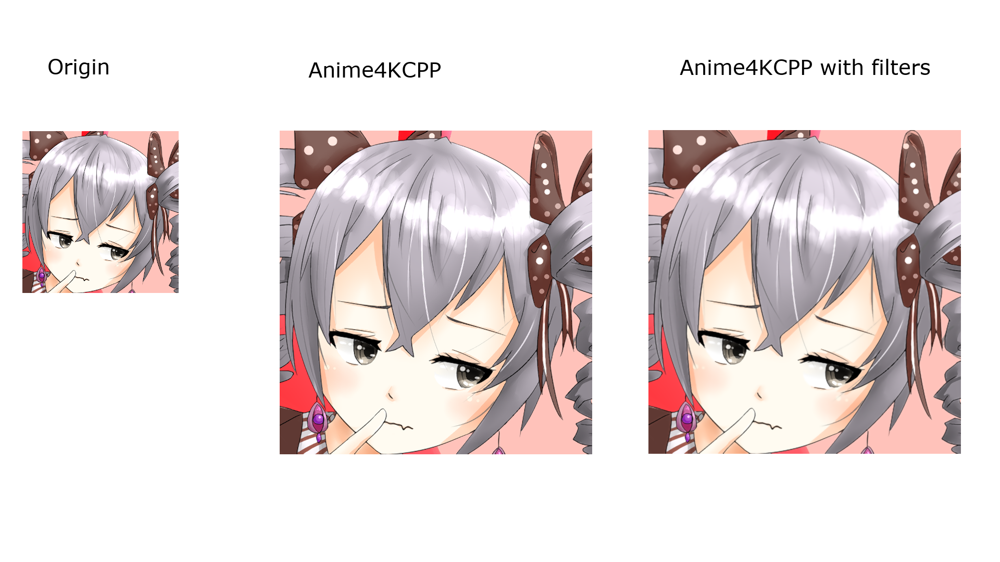
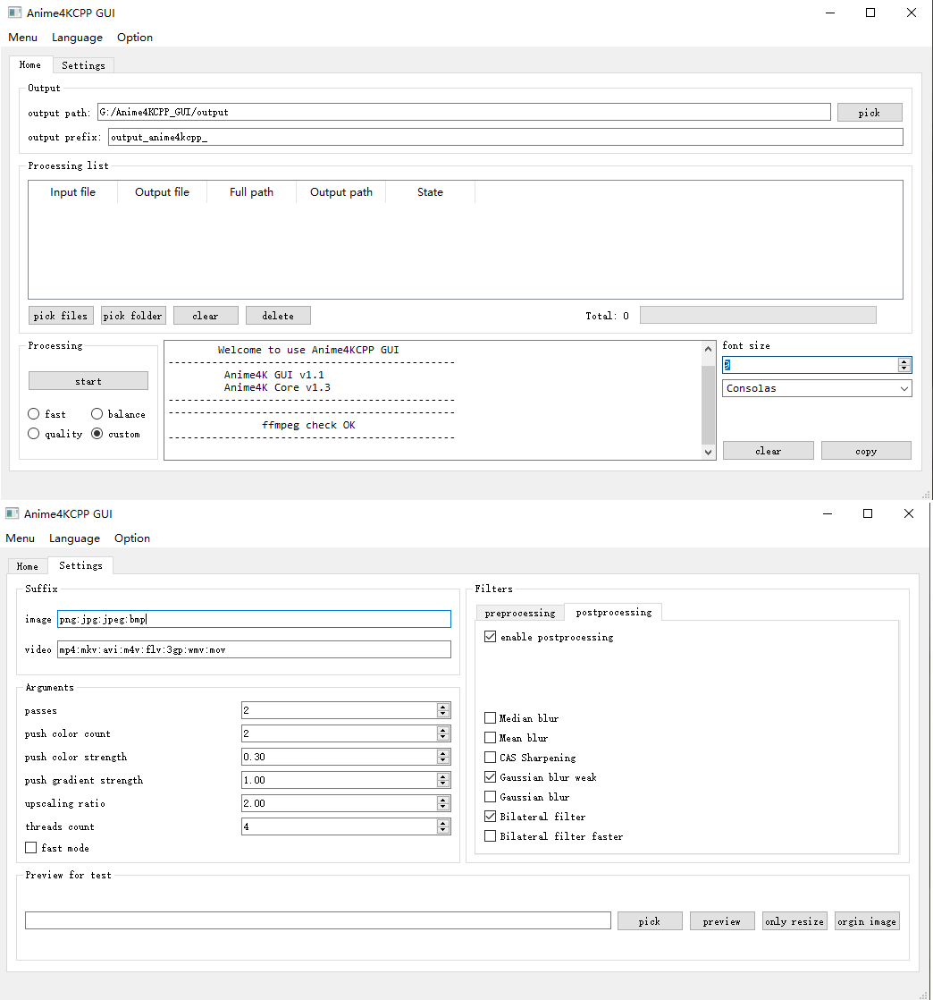

[**中文文档**](README.cn.md)

# Anime4KCPP
This is an implementation of Anime4K in C++. It based on the [bloc97's Anime4K](https://github.com/bloc97/Anime4K) algorithm version 0.9, and try to optimize it to provide better quality, it aims to be a high performance pretreatment tools to process both image and video.  
This project is for learning and the exploration task of algorithm course in SWJTU.  

***NOTICE: With CPU, it is fast enough to process normal image, It is about 12 times faster than [Go version](https://github.com/TianZerL/Anime4KGo), and 1300 times faster than [Python version](https://github.com/TianZerL/Anime4KPython). With GPU acceleration, it can be more than 10 times faster than CPU (depends on your graphic card), so it is suitable for video processing, just try this for higher quality and speed.***

# About Anime4K
Anime4K is a simple high-quality anime upscale algorithm for anime. it does not use any machine learning approaches, and can be very fast in real-time processing or pretreatment.

# Why Anime4KCPP
- Cross-platform, building have already tested in Windows and Linux, MACOS is also supported.
- Wide compatibility, support both CPU and GPU.
- easy to use with GUI or CLI.
- High performance.
- GPU acceleration support, use it to process your image or video in a short time.
- More arguments for you, you can get a better quality than real-time playback.
- Filters support, use them to denoise or anti-aliasing.

# Result


# GPU acceleration
Anime4KCPP now supports GPU acceleration, which is implemented by original OpenCL for high performance, it supports any graphic card that implemented OpenCL 1.2 or newer, and can complete 1080 -> 4K image processing in 0.1s on *AMD Vege 8 Graphics* (integrated in *AMD Ryzen 3500U*).

# Performance
CPU: AMD Ryzen 3500U  
GPU: AMD Vege 8 Graphics  
RAM: 16G  
Anime4KCPP Version : 1.6.0  
Anime4KCPP Settings: balance  

    CPU:
    Image:
    256x256 -> 512x512:   0.025s  
    1080P   -> 4k:        0.650s  

    Video(Length: 1 min 32 seconds):
    480P  -> 1080P :       3  min 13 seconds
    1080P -> 4K :          19 min 09 seconds

    GPU:
    Image:
    256x256 -> 512x512:   0.006s  
    1080P   -> 4k:        0.090s  

    Video(Length: 1 min 32 seconds):
    480P  -> 1080P :       0  min 31 seconds
    1080P -> 4K :          3  min 00 seconds

# GUI
Anime4KCPP now provides a GUI interface, upscale your image or video by an easier way!  
***NOTICE: please install [ffmpeg](https://ffmpeg.org) for video processing firstly***  


# CLI
## Video processing
For video processing, all you need do is to add the argument ```-v```, and waiting. The video processing supports multithreading, and by default uses all CPU threads, but you can adjust it manually by ```-t``` to specify the number of threads for processing.

## Usage
### building
Please install [OpenCV Library](https://opencv.org) before building, and the [release version](https://github.com/TianZerL/Anime4KCPP/releases) have already included OpenCV runtime.  

You need get a OpenCL SDK from your graphic card provider, this is [the one](https://github.com/GPUOpen-LibrariesAndSDKs/OCL-SDK/releases) that provided by AMD.

And you need Qt open source version for building GUI.

If you want to process video, please install [ffmpeg](https://ffmpeg.org) firstly, otherwise the output will be silent. And make sure you have [OpenH264 encoder](https://github.com/cisco/openh264/releases) for encoding.

This project uses [cmake](https://cmake.org) to build.

### arguments

    options:
      -i, --input               File for loading (string [=./pic/p1.png])
      -o, --output              File for outputting (string [=output.png])
      -p, --passes              Passes for processing (int [=2])
      -n, --pushColorCount      Limit the number of color pushes (int [=2])
      -c, --strengthColor       Strength for pushing color,range 0 to 1,higher for thinner (double [=0.3])
      -g, --strengthGradient    Strength for pushing gradient,range 0 to 1,higher for sharper (double [=1])
      -z, --zoomFactor          zoom factor for resizing (double [=2])
      -t, --threads             Threads count for video processing (unsigned int [=8])
      -f, --fastMode            Faster but maybe low quality
      -v, --videoMode           Video process
      -s, --preview             Preview image
      -b, --preProcessing       Enable pre processing
      -a, --postProcessing      Enable post processing
      -r, --preFilters          Enhancement filter, only working when preProcessing is true,there are 5 options by binary:Median blur=0000001, Mean blur=0000010, CAS Sharpening=0000100, Gaussian blur weak=0001000, Gaussian blur=0010000, Bilateral filter=0100000, Bilateral filter faster=1000000, you can freely combine them, eg: Gaussian blur weak + Bilateral filter = 0001000 | 0100000 = 0101000 = 40(D) (unsigned int [=4])
      -e, --postFilters         Enhancement filter, only working when postProcessing is true,there are 5 options by binary:Median blur=0000001, Mean blur=0000010, CAS Sharpening=0000100, Gaussian blur weak=0001000, Gaussian blur=0010000, Bilateral filter=0100000, Bilateral filter faster=1000000, you can freely combine them, eg: Gaussian blur weak + Bilateral filter = 0001000 | 0100000 = 0101000 = 40(D), so you can put 40 to enable Gaussian blur weak and Bilateral filter, which also is what I recommend for image that < 1080P, 48 for image that >= 1080P, and for performance I recommend to use 72 for video that < 1080P, 80 for video that >=1080P (unsigned int [=40])
      -q, --GPUMode             Enable GPU acceleration
      -l, --listGPUs            list GPUs
      -h, --platformID          Specify the platform ID (unsigned int [=0])
      -d, --deviceID            Specify the device ID (unsigned int [=0])
      -?, --help                print this message

## Filters
Enable filters can make the result be better, now Anime4kCPP support following filters:

  - Median blur [0000001]
  - Mean blur [0000010]
  - [CAS Sharpening](https://gpuopen.com/gaming-product/fidelityfx) [0000100]
  - Gaussian blur weak [0001000]
  - Gaussian blur [0010000]
  - Bilateral filter [0100000]
  - Bilateral filter faster [1000000]

You can freely combine them by their binary.  
eg: Gaussian blur weak + Bilateral filter = 0001000 | 0100000 = 0101000(B)= 40(D)  

you can use ```-b``` to enable preprocessing filters function, and then use ```-r``` to custom your own combination, normally, if you don't specify the ```-r``` manually it will be 4. You can use command like this:

    Anime4KCPP -i input.png -o output.png -b -r 44


Easily use ```-a``` to enable postprocessing filters function, and then use ```-e``` to custom your own combination, normally, if you don't specify the ```-e``` manually it will be 40. You can use command like this to enable Gaussian blur and Bilateral filter:

    Anime4KCPP -i input.png -o output.png -a -e 48

I recommend use 40(Gaussian blur weak + Bilateral filter) for image that < 1080P, 48(Gaussian blur + Bilateral filter) for image that >= 1080P, and 72(Gaussian blur weak + Bilateral filter faster) for video that < 1080P, 80(Gaussian blur + Bilateral filter faster) for video that >=1080P.

It is not sure which will be better between pre and post processing, it depends on the specific image, you can try different combination for best quality.

CAS is an adaptive sharpening technology which is open source by AMD, simple but efficient.

# pyanime4k
[pyanime4k](https://github.com/TianZerL/pyanime4k) is a simply package to use anime4k in python, easy, fast and powerful, which support both image and video processing, based on Anime4KCPP. 


# Other implementations
- Python
  - [TianZerL/Anime4KPython](https://github.com/TianZerL/Anime4KPython)
- Go
  - [TianZerL/Anime4KGo](https://github.com/TianZerL/Anime4KGo)
- C#
  - [shadow578/Anime4kSharp](https://github.com/shadow578/Anime4kSharp)
  - [net2cn/Anime4KSharp](https://github.com/net2cn/Anime4KSharp)
- Java
  - [bloc97/Anime4K](https://github.com/bloc97/Anime4K)
- Rust
  - [andraantariksa/Anime4K-rs](https://github.com/andraantariksa/Anime4K-rs)

# Acknowledgement
All images are drawn by my friend ***King of learner*** and authorized to use, only for demonstration, do not use without permission.